# SysArc Infomatix Pvt Ltd

LAPS/LENDperfect – User Manual

MSME – PM Vishwakarma

Prepared by: SysArc Infomatix Pvt Ltd

Submission Date:

Version: v 1.0

Request from: Punjab & Sind Bank</h4>

## Preamble

This document is prepared by SysArc Infomatix Pvt Ltd. SysArc Infomatix Pvt Ltd. reserves the right to amend any portion of this document at any time. This document is marked as confidential and provided for internal use in connection with SysArc’s services only. All information contained in the document is proprietary and confidential and all rights therein are reserved with SysArc Infomatix Pvt Ltd. Client shall not disclose this document to any third party other than the intended receiver. Use of this document is subject to the terms and conditions in force with SysArc.  By receiving/downloading this document, the client expressly acknowledges and accepts this disclaimer. 

## Document Revision History

| Ver. No | Ver. Date | Prepared By | Reviewed By | Approved By | Affected Section & Summary of Change |
|---|---|---|---|---|---|
| 1.o | 27 Nov 2025 |||||

## Table of Content

- [Chapter 1 Getting Started](#GS)
    - [Introduction](#i)
    - [LAPS Scheduler to Fetch Leads from Portal](#laps)
    - [Login Page](#login-page)
        - [Sanctioned Applications](#sanctioned-applications)
            - [Process Flow](#process-flow)
            - [Sanction Inbox](#sanction-inbox)
        - [Branch Assisted Journey](#branch-assisted-journey)
            - [Process Flow](#process-flow)
            - [Branch Assisted Inbox](#branch-assisted-inbox)
        - [Closed Application](#closed-application)
            - [Process Flow](#process-flow)
            - [Closed Application Inbox](#closed-application-inbox)
    - [Summary](#summary)

<!-- /TOC -->

## About SysArc

Founded in 1997, with industry strength and experience in the financial and banking sector. We develop world-class banking solutions - primarily focused on effective implementation of the business process, cutting down on operating expenses, reducing processing time and increasing customer satisfaction multi-fold. We have expanded into the financial services software arena, with the same dedication to excellence to be a touchstone of corporate culture. We do not simply produce software. we create innovative solutions that allow the customers to outperform their competitors.

## Acknowledgements

The documentation team along with Subject Matter Experts (SMEs) have contributed towards the creation of this document. This document has been a team effort with each member providing their inputs and suggestions for improvement so that the document meets End-User requirements. The team consists of Senior Technical Writer, Subject Matter Expert and unnamed countless other members who have made this approach document possible.  

## Document Conventions

The normal font used in the document is Cambria.
The main pages are divided into chapters. Each chapter starts with Heading 1.
The sub-pages are further divided into sections and subsections are represented as Heading 1.1, through Heading 1.1.1.1.1 
The steps involved to navigate through the application are provided in Bullet points. Sometimes the bullet points may have sub-levels of steps. Each level will display different Bullet points.
The information that needs emphasis is in Bold Fonts. It may represent the page name, field name, drop-down, checkbox, radio buttons, links, or action buttons.
The content “Bolded and inserted within Quotes” represents the pre-set options or list values that you may select from one of the various control fields. E.g.: “Yes”, “No”.
A note inserted in the document at relevant places is represented with  (note icon) at relevant locations.
Any References will be represented with   (book icon) at relevant locations.
Any Warning message is represented with   (alert icon) at relevant locations.
Any Alert messages are represented with   (alert icon) at relevant locations.
Any Hyperlink is represented in with normal font in blue color, bolded, underlined and italicized and displays as “***Hyperlink***.”

# Chapter 1 Getting Started

## 1.1	Introduction

This chapter discusses about process flow of **PM Vishwakarma Yojana** through **STP** and Branch **Assisted journeys**.

## 1.2	LAPS Scheduler to Fetch Leads from Portal

All the PM Vishwakarma applications punched by the applicants will be fetched by the PMV Lendperfect system using a scheduler which will be executed on a regular interval fetch the details through an API hosted by PMV portal. The leads fetched from the portal will be available for the users of the respective branches based on the IFSC mapping in the LendPerfect module. 

> Note:
>
> The PMV applications will be classified into two categories based on the BRE check:
> - If pre-BRE & MAIN BRE Success, it will display under **Sanctioned Inbox**.
> - If pre-BRE check fails, it will display under **Branch Assisted Inbox** for Manual processing of the application.
> - If MAIN Bre check fails, it will display under **Branch Assisted Inbox** to know the reason for the failure.

## 1.2.1	Login Page
On clicking the specific URL, you will land on Log in page as shown below.

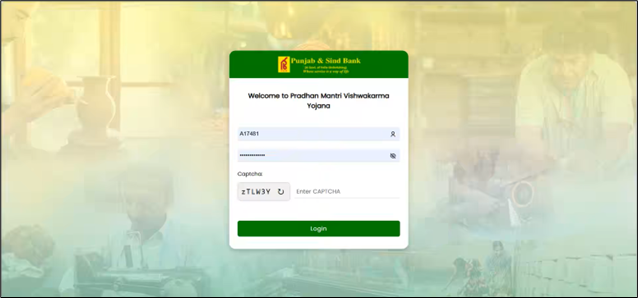

**Step 1.**	Enter the **User ID**, **Password**, and **Captcha**, and then click Login.
**Step 2.** Upon successful login, you land on the home screen where the set of inboxes will be shown as follows.

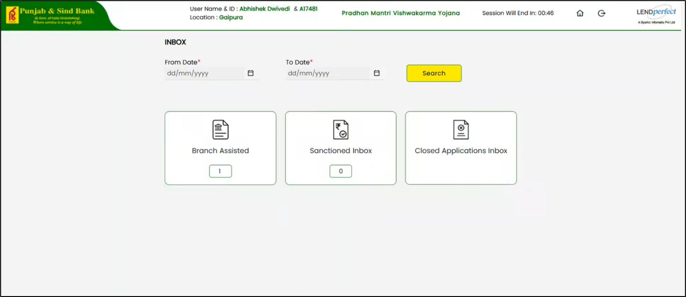

### 1.2.2	Sanctioned Applications

#### 1.2.2.1	Process Flow

In the backend, the PM Vishwakarma application will pull all the leads from PMV portal which are success in Pre BRE and Main BRE check will list in sanctioned inbox.

**Step 1.** For the post sanction you need to choose the mode of documentation from the ratio button to upload the document.
> Note:
> 
> There are two documentation modes available:
> 1. **Digital Documentation** - The customer will get the link to complete DDE at their end.
> 1. **Manual Documentation** - For any reason if the customer is not able to complete the DDE, you will have the option to download the Prefilled Document for Manual Documentation.

**Step 2.** In **Digital Documentation** mode, click **Initiate DDE** for all legal documents. The customer will receive a link to complete the DDE process on their end.

**Step 3.** The DDE link is valid for 24 hours. If the link expires, you can reinitiate DDE. 

**Step 4.** If the customer cannot complete the e-sign process or NeSL is not operational in the state, you can download the prefilled document for manual documentation mode by clicking prefilled document button.  

**Step 5.** Clicking Manual Documentation button. Select Mode of Documentation to manual Documentation ratio button. When selected, options to generate legal documents are enabled in the grid for each document. You can generate the document, print it, and obtain the customer’s physical signature.

**Step 6**. After signing, upload the signed copy using the provided Upload button. The Account Handoff button is enabled once all signed documents are uploaded in the system.

**Step 7.** Click Account handoff button the Account Number along with Disbursement details received as response will be saved and displayed in online module.

**Step 8.** Click Disbursement Update to do the reverse update to PMV portal and the journey will be completed.

#### 1.2.2.2	Sanction Inbox

**Step 1.** Click Sanctioned Inbox the list of applications will display as shown below.

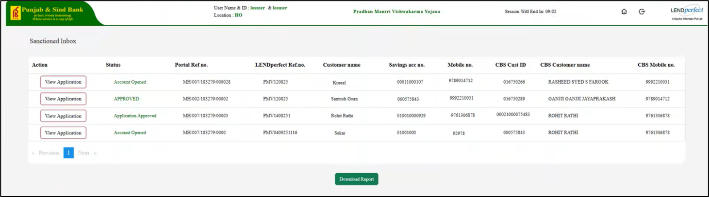

**Step 2.** Click View Application to view the corresponding application.

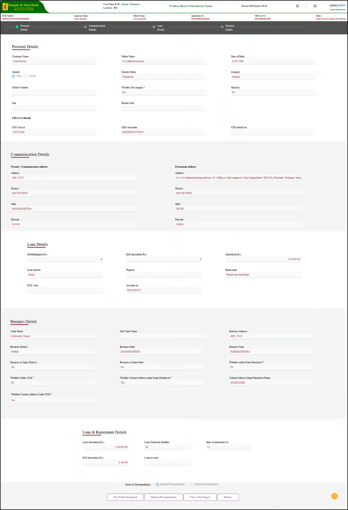

**Step 3.** **Personal details**, **Communication details**, **loan details**, **business details** section are auto populated and non editable.

**Step 4.**  Once the application is approved, the system switches to Digital Documentation mode, which is the default flow.

**Step 5.** Click **Initiate DDE** to initiate the DDE for all the Legal documents in the LENDperfect system, and the customer will get the link to complete DDE at their end.

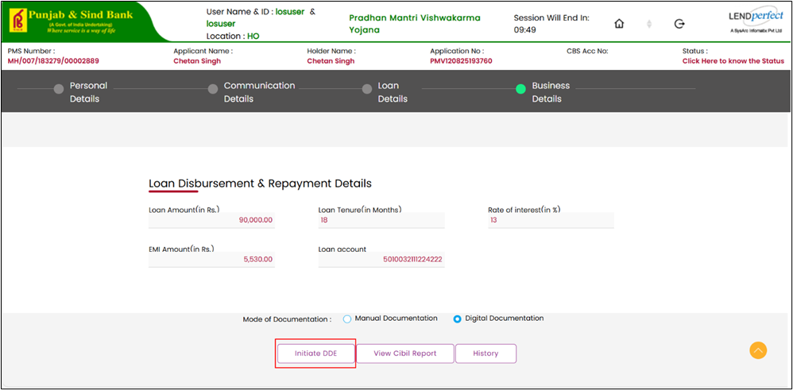

**Step 6.** Till the completion of this activity by customer, the status will be marked as "**DDE on progress**".

**Step 7.**	Until the callback received at our end the system displays Retrigger Link and Check Status button.

**Step 8.**	Once the DDE is completed, the digitally signed document will be downloaded automatically in the LENDperfect system and system enables the Signed Document, Account Handoff, and Disbursement Update button.

**Step 9.**	Click Account handoff and Disbursement Update button to complete the journey.

**Step 10.** If the customer cannot complete the DDE process for any reason, select Manual Documentation from Mode of Documentation checkbox.

**Step 11.** Click Pre-Filled Document to view and download the list of prefilled documents.

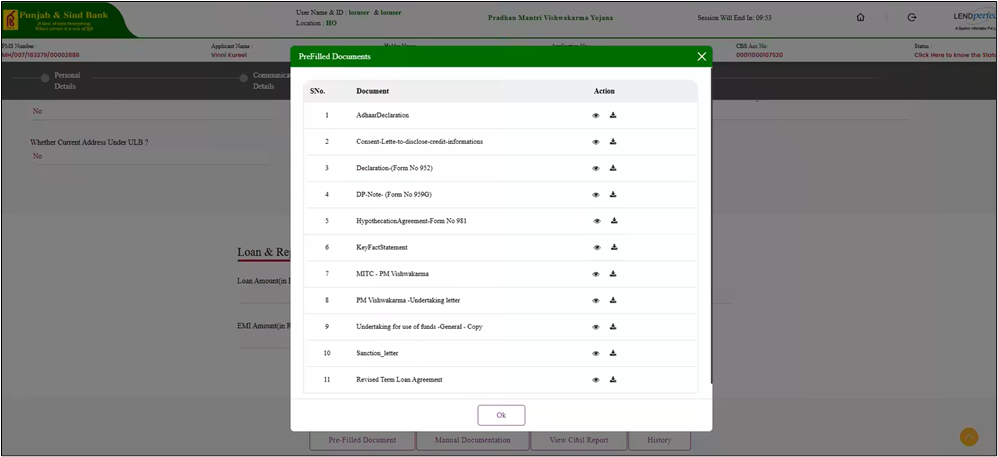

**Step 12.** Click **Manual Documentation** and then upload the customer-signed documents.

**Step 13**. Click Upload to complete the upload.

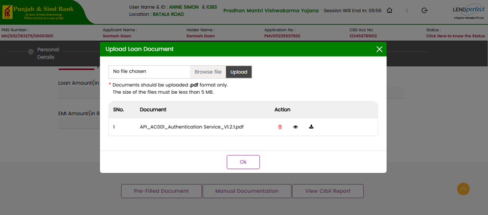

**Step 14.** The Account Handoff button is enabled once all signed documents are uploaded in the system.

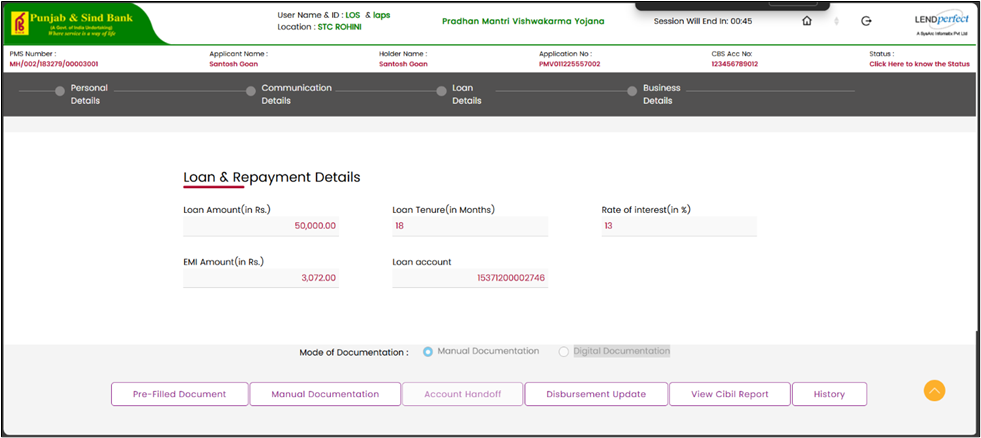

**Step 15.** Click Account handoff to complete the application process.

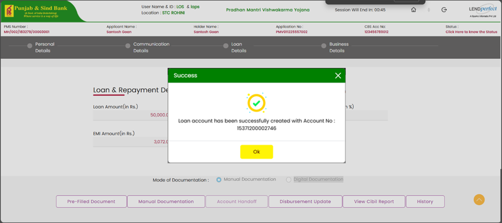

**Step 16.** Click Disbursement Update to do the reverse update to PMV portal and the journey will be completed.

**Step 17.** Click View Cibil Report to view and download the cibil report.

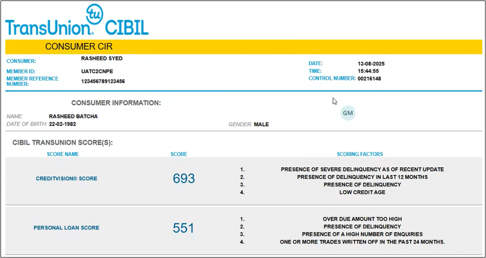

**Step 18.** Click History to view the history of the application.

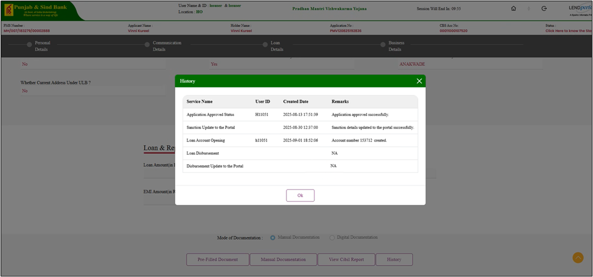

### 1.2.3	Branch Assisted Journey

#### 1.2.3.1	Process Flow

The application which failed in Pre BRE and Main BRE will display under branch assisted journey.

**Step 1.** The system enables the modify button for you to manually enter the operative account number to continue the journey.

**Step 2.**	The system initiates the BRE process.

**Step 3.**	The system retrieves customer details from CBS using the operative account number provided by the PMV Portal.

**Step 4.** The system handles CIBIL API initiation: 

    •	If initiation fails due to technical issues, the system updates the status to CIBIL API Failed and allows reinitiation.

    •	If initiation succeeds, the system waits for the response and then proceeds to BRE check.

**Step 5.**	The system runs the BRE check, upon BRE succeeds, the system updates the status to Approved, moves the application to the Auto Sanctioned Inbox, and triggers the Call Sanction API to update the PMV Portal.

**Step 6.**	After the application is sanctioned the flow of this application will be same as mentioned from [Step 4.](id="Loop") to step 12 as mentioned in sanctioned backend flow.

#### 1.2.3.2	Branch Assisted Inbox

**Step 1.** Click **Branch Assisted Inbox** the list of applications will display as shown below.

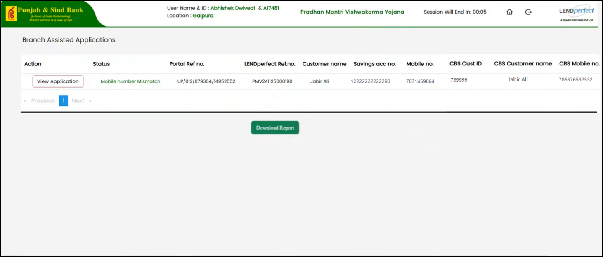

**Step 2.** Click **View Application** to view the corresponding application.

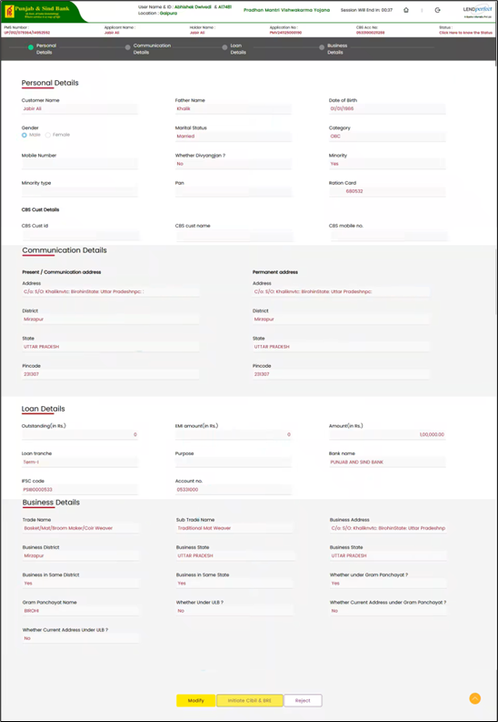

**Step 3.** **Personal details**, **Communication details**, **loan details**, **business details** section are auto populated.

**Step 4.**	When the account number received from the PMS portal does not match any record in CBS, the CBS Customer Details section remains blank.

**Step 5.**	The system enables the **Modify** option, allowing the account number field to be edited. 

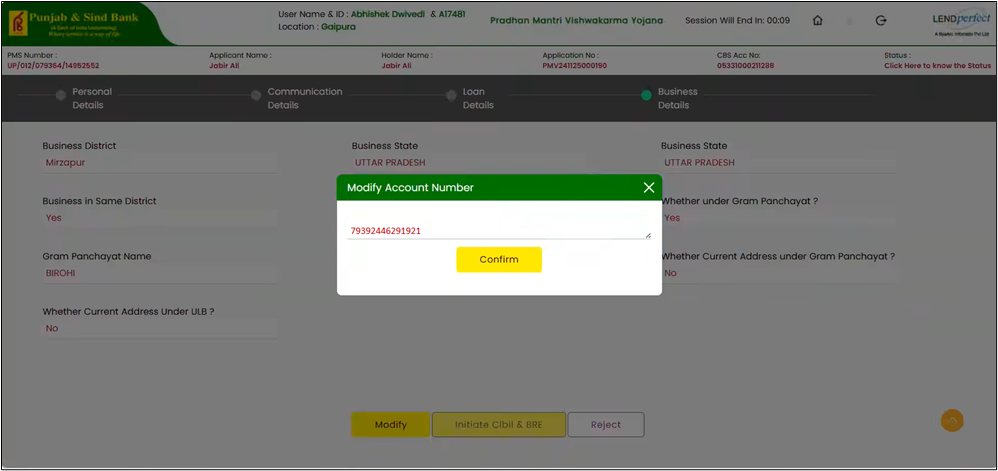

**Step 6.** Enter the correct savings account number in modify account number popup.

**Step 7.**	The system retrieves the corresponding CBS customer details and displays them in the CBS Customer Details section.

**Step 8.**	Once CBS details are available, the **Initiate Cibil & BRE** button becomes active.

**Step 9.**	Click **Initiate Cibil & BRE** to save the updated details and proceed to the next step.

**Step 10.** If CBS details are not available, the **Initiate Cibil & BR**E button remains disabled.

**Step 11.** Once the Cibil response is received, the system triggers the BRE check.

**Step 12.** If BRE fails, the system will mark the status as **Rejected** and status will be updated in PM Vishwakarma portal along with the rejection reason.

**Step 13.** On the successful completion of all the BRE parameters, the case will be marked as **Approved** digitally and the status will be reverse updated to the PM Vishwakarma portal.

> Note:
>Once the application is approved, system triggers the email to branches.

**Step 14.** Once the sanction is completed, application will be moved to Sanctioned inbox. You can initiate documentation from the Sanctioned Application section as mentioned in case of Auto sanctioned application. 

**Step 15.** The remaining flow will be same as auto sanctioned application.

**Step 16.** Reject button will be available to you till the application is sanctioned. Enter the reject reason in the remarks section. Once you reject the application the status will be updated to Portal with the rejection reason.

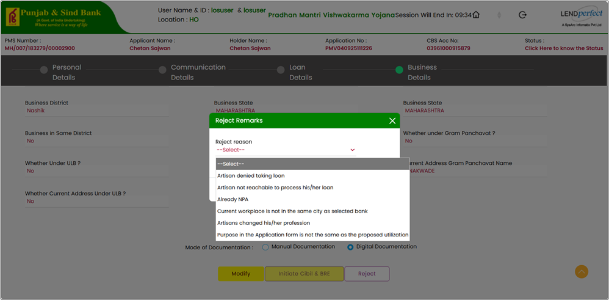

### 1.2.4	Closed Application

#### 1.2.4.1	Process Flow

**Step 1.** In the backend, At the end of the day, LAPS updates the closed status in the PMV tables for accounts that are closed in CBS.

**Step 2.**	The system runs a scheduler to find loan accounts that have the closed status updated in PMV tables.

**Step 3.**	The system calls the Close API to update the closure status for all identified accounts in the portal.

**Step 4.**	If close status is successful, accounts successfully updated in the portal appear in the **Closed in Portal** tab and accounts remain visible for 30 days from the closure date.

**Step 5.**	If close status is failed, accounts failed to update appear in the **Update Failed** tab and accounts remain visible for 30 days.

**Step 6.**	Navigate to the **Closed loan inbox** and click **Update failed tab**.

**Step 7.**	Click **Update status** for each application. System triggers the Call Close API.

**Step 8.**	If successful, the system disables the button for that account.

**Step 9.**	Clicks **Update Status for All** to update all pending accounts displayed on the screen.

**Step 10.** The system triggers the **Call Close API** for all accounts with pending closure status.

**Step 11.** After the update, the system displays an alert showing the count of successfully updated accounts.

#### 1.2.4.2	Closed Application Inbox

**Step 1.** Click Closed Application Inbox the set of tabs will display as shown below

**Step 2.** In the **Closed in Portal inbox**, Loan accounts for which the status update to the portal is successful at the time of running scheduler will be displayed.

**Step 3.** Click **Download Report** to download the date and displayed in excel format.

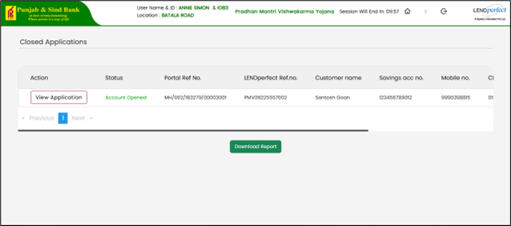

**Step 4.** Loan accounts for which the status update to the portal failed at the time of running scheduler will be displayed in **Update Failed**.

**Step 5.** Click **Update status** to manually update the closure status, if the update is successful, system will display “Update successful” message.

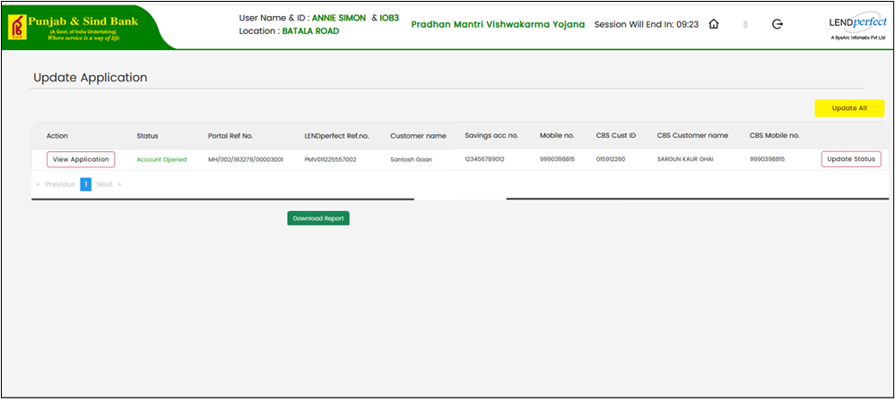

**Step 6.** If any technical error occurs, system will display error to the user.

**Step 7.**	Click **Update all** , system will trigger the status update API for all the applications that are displayed on screen.

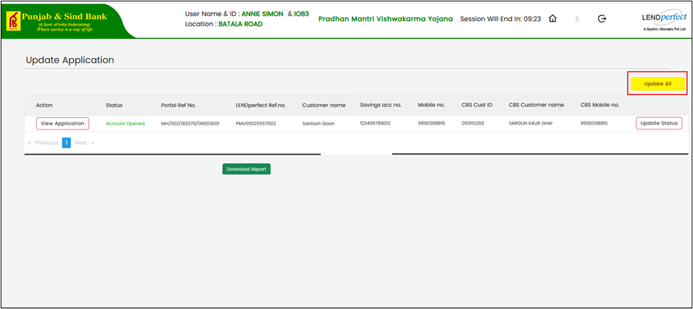

## 1.3	Summary

In this chapter, you learned how to process loan applications in PSB PM Vishwakarma Yojana portal, including auto-sanctioned and branch-assisted flows, from pulling applications and running validations to account handoff, disbursement, and updating statuses to the PMV portal.
